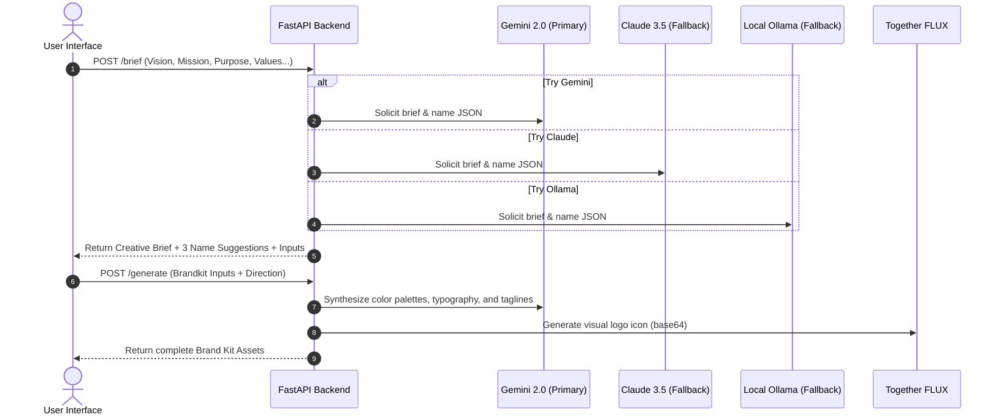

# 🎨 Klipso Brand Forge

Welcome to **Klipso Brand Forge**! An elegant, open-source, single-screen AI brand generator that transforms raw company concepts into high-fidelity, designer-grade brand kits. 

Built with love for startups, designers, and developers who want premium branding assets in seconds, completely automated yet editable at every step.

---

## ✨ What is this?

Klipso Brand Forge is a professional web application that bridges the gap between raw strategy and visual assets. Instead of generating random logos, Klipso uses a two-phase generative workflow:
1. **Strategic Synthesis**: Connects your vision, mission, purpose, and values into a cohesive, structured **Creative Brief** using advanced LLMs, proposing 3 design-aligned names with rationales.
2. **Visual Forging**: Uses your refined, edited brief to synthesize complete color palettes, font pairings, taglines in English/Spanish, and high-fidelity, geometric vector logos powered by state-of-the-art diffusion models.

---

## 🖥️ The Demo Workflow

The interface is structured as a **Single-Screen Brand Workspace**:
- **Phase 1 (Input)**: Fill in your company values, purpose, mission, vision, and keywords on the left strategy workspace.
- **Phase 2 (The Brief)**: Review the generated brief, select one of the suggested names, select a personality profile, choose an aesthetic direction, and edit any text to your liking.
- **Phase 3 (The Assets)**: Click "Forjar Identidad" to instantly generate color palettes (click to copy Hex values), typographic scales, eslogans, and a beautiful vector logo ready for immediate JPG download.

---

## 🛠️ The Tech Stack

Klipso Brand Forge is crafted using a modular, highly performant stack:
* **Frontend**: Next.js 14 (React), styled with CSS and custom glassmorphism components. Responsive and interactive.
* **Backend**: FastAPI (Python), high-speed routing and API serialization.
* **AI Engine**: 
  * **Gemini 2.0 Flash** (via `google-generativeai`) – Directs the primary strategic brief generation, color rationales, font pairings, and name suggestions.
  * **Together AI FLUX Dev** (`black-forest-labs/FLUX.1-schnell`) – Generates pristine, minimalist geometric vector logos without text pollution.
  * **Claude 3.5 Sonnet & Local Ollama (Qwen 3:8b)** – Configured as automatic fallback engines for maximum reliability and uptime.

---

## 🚀 Getting Started

Follow these steps to get your own instance of Klipso Brand Forge running locally or on your server.

### Prerequisites
* Python 3.10+
* Node.js 18+
* API Keys for Google (Gemini) and Together AI (Flux).

### 1. Clone & Set Up Backend

```bash
# Clone the repository
git clone https://github.com/StephCastrof001/klipso_branding-logo.git
cd klipso_branding-logo/backend

# Create a virtual environment
python3 -m venv .venv
source .venv/bin/activate  # On Windows: .venv\Scripts\activate

# Install dependencies
pip install -r requirements.txt
# (or pip install fastapi uvicorn google-generativeai httpx pillow pydantic pytest)
```

Create a `.env` file inside the `backend` directory:
```env
GOOGLE_API_KEY="your-google-api-key"
TOGETHER_API_KEY="your-together-api-key"
# Optional Fallback Key
ANTHROPIC_API_KEY="your-anthropic-api-key"
```

Start the backend API server:
```bash
uvicorn main:app --host 0.0.0.0 --port 8000
```

### 2. Set Up Frontend

```bash
cd ../frontend

# Install node dependencies
npm install

# Start development server
npm run dev -- -p 3005
```

Open your browser to `http://localhost:3005` to experience your new branding workspace!

---

## 📐 Architecture & Pipeline Flow

The workflow is designed to be highly interactive and robust. It prioritizes API reliability with triple-LLM fallback logic.



---

## 🔌 API Reference

### 1. `POST /brief`
Generates a refined creative brief, name suggestions, and structured inputs for the brand generator.

#### Request Body
```json
{
  "company_name": "Klipso",
  "vision": "democratizar el diseño digital",
  "mission": "branding premium accesible",
  "purpose": "Hacer diseño instantáneo de calidad profesional para todos",
  "values": ["innovacion", "agilidad", "sencillez"],
  "industry": "SaaS",
  "keywords": "moderno, limpio, minimalista, digital",
  "target_audience": "startups y creadores de contenido"
}
```

#### Example cURL
```bash
curl -X POST http://localhost:8000/brief \
  -H "Content-Type: application/json" \
  -d '{
    "company_name": "Klipso",
    "vision": "democratizar el diseño digital",
    "mission": "branding premium accesible",
    "purpose": "Hacer diseño instantáneo de calidad profesional para todos",
    "values": ["innovacion", "agilidad", "sencillez"],
    "industry": "SaaS",
    "keywords": "moderno, limpio, minimalista, digital",
    "target_audience": "startups y creadores de contenido"
  }'
```

#### Response Body (JSON)
```json
{
  "brief": "Brief creativo para Klipso: Enfocado en la industria SaaS. Con la visión clara de democratizar el diseño digital...",
  "name_suggestions": [
    {
      "name": "Klipso Forge",
      "rationale": "Combina la solidez del sector con la forja del branding interactivo."
    },
    {
      "name": "NovaBrand",
      "rationale": "Representa el renacimiento estético y el brillo de la nueva identidad visual."
    },
    {
      "name": "KlipsoNext",
      "rationale": "Evoca el salto hacia adelante en diseño inteligente y automatización premium."
    }
  ],
  "brandkit_inputs": {
    "brand_name": "Klipso",
    "brand_description": "Pioneering company in SaaS focused on high-end design solutions.",
    "brand_industry": "SaaS",
    "company_keywords": ["moderno", "limpio", "minimalista", "digital", "SaaS"],
    "brand_personality": "Sophistication",
    "target_segment": "startups y creadores de contenido"
  }
}
```

---

### 2. `POST /generate`
Generates a comprehensive brand identity kit including custom color rationales, typography, slogans, and logos.

#### Request Body
```json
{
  "brandkit_inputs": {
    "brand_name": "Klipso",
    "brand_description": "Pioneering company in SaaS focused on high-end design solutions.",
    "brand_industry": "SaaS",
    "company_keywords": ["moderno", "limpio", "minimalista", "digital", "SaaS"],
    "brand_personality": "Sophistication",
    "target_segment": "startups y creadores de contenido"
  },
  "direction": "minimal"
}
```

#### Example cURL
```bash
curl -X POST http://localhost:8000/generate \
  -H "Content-Type: application/json" \
  -d '{
    "brandkit_inputs": {
      "brand_name": "Klipso",
      "brand_description": "Pioneering company in SaaS focused on high-end design solutions.",
      "brand_industry": "SaaS",
      "company_keywords": ["moderno", "limpio", "minimalista", "digital", "SaaS"],
      "brand_personality": "Sophistication",
      "target_segment": "startups y creadores de contenido"
    },
    "direction": "minimal"
  }'
```

#### Response Body (JSON)
```json
{
  "palettes": [
    {
      "hex": "#0F172A",
      "name": "Primary Accent",
      "desc": "Reflects the core values, authority, and emotional stability of the brand."
    },
    {
      "hex": "#0EA5E9",
      "name": "Secondary Accent",
      "desc": "Brings balance, representing growth, modern technology, and clarity."
    },
    {
      "hex": "#F8FAFC",
      "name": "Active Highlight",
      "desc": "A vibrant touchpoint designed to guide user attention and highlight interactive elements."
    }
  ],
  "typography": [
    {
      "type": "Heading Font",
      "name": "Montserrat",
      "desc": "Used for hero titles and major visual typography to establish brand presence."
    },
    {
      "type": "Body Font",
      "name": "Inter",
      "desc": "Used for reading legibility across standard content and descriptions."
    },
    {
      "type": "Accent Font",
      "name": "Fira Code",
      "desc": "Used for labels, code segments, secondary CTAs, or highlighted captions."
    }
  ],
  "taglines": {
    "en": "Simplifying the future.",
    "es": "Simplificando el futuro."
  },
  "logos": [
    "data:image/jpeg;base64,/9j/4AAQSkZJRgABAQ..."
  ]
}
```

---

## 🤝 Contributing

We welcome contributions from the open-source community!
1. **Fork** the repository.
2. Create a new feature branch: `git checkout -b feat/amazing-feature`.
3. **Commit** your changes: `git commit -m 'feat: add amazing feature'`.
4. **Push** to the branch: `git push origin feat/amazing-feature`.
5. Open a **Pull Request** detailing your changes.

Make sure to run the test suite local verification script before submitting:
```bash
pytest backend/test_api.py -v
```

Let's build the future of automated premium branding together! 🚀
