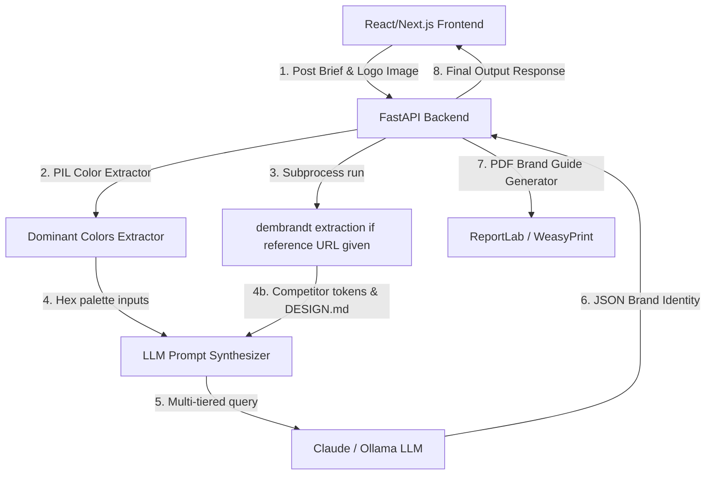

# Technical Reconnaissance Report: brandkit-ai & dembrandt

This report provides a deep-dive analysis of the capabilities, workflows, inputs, outputs, and limitations of `brandkit-ai` and `dembrandt`, followed by a production-ready architectural design to integrate them into a unified web application pipeline: **Brief + Logo → Unified Brand Identity Output**.

---

## 1. brandkit-ai (Deep-Dive Analysis)

### What it *Really* Does
Contrary to marketing generalities, `brandkit-ai` is a **Streamlit python prototype** that uses OpenAI (DALL-E-3) and Anthropic (Claude-3.5-Sonnet) to dynamically generate brand concepts, coupled with a local sentence-transformer encoding step to query a Pinecone index for market research.

### Code Flow & Core Architecture
1. **User input collection** via Streamlit text fields (name, description, industry, keywords, personality, target segment).
2. **Local vector embedding generation** of user input using a lightweight Hugging Face model (`sentence-transformers`).
3. **Similarity query to Pinecone** (requires pre-configured index named `"brandkit"` containing competitor/market brands).
4. **LLM Prompt Synthesis**: Combines the user input with the top competitor matches retrieved from Pinecone.
5. **Claude API Call**: Submits the synthesis to Claude-3-5-Sonnet requesting 3-5 colors (HEX), 2-3 fonts, taglines, and a textual logo concept.
6. **OpenAI API Call**: Parses the text output from Claude to extract suggested hex codes and the logo concept. It formats a refined prompt and calls **DALL-E-3** to generate 3 logo options.
7. **Streamlit Rendering**: Renders the markdown text and displays the generated DALL-E images from their OpenAI CDN URLs.

### Required Inputs
* `brand_name` (String)
* `brand_description` (String/Textarea)
* `brand_industry` (String)
* `company_keywords` (Comma-separated string list)
* `brand_personality` (Select options: *Competence, Excitement, Sincerity, Sophistication, Ruggedness*)
* `target_segment` (String)

### Generated Outputs
* **Brand kit content (Markdown)**: 3-5 hex colors with rationale, 2-3 font pairings, 1 tagline, and a descriptive logo concept.
* **3 Logo Assets**: Image URLs hosted on the OpenAI DALL-E CDN.

### Key Limitations & Dependencies
* **API Hard-Dependencies**: Fails completely without active Anthropic and OpenAI API keys configured directly in code.
* **Pinecone Index Dependency**: The code expects a pre-populated Pinecone index. If keys or the index is missing, the similarity search crashes.
* **Cold Boot / Performance**: Generating 3 DALL-E-3 images in a sequential loop can take up to 20-30 seconds, causing UI latency.
* **No Image Upload Support**: The original codebase *cannot* accept an existing logo image to extract styles from; it only generates *new* logos.

---

## 2. dembrandt (Deep-Dive Analysis)

### What it *Really* Does
`dembrandt` is a **Node.js CLI tool** that performs deep static and dynamic auditing of a live website to extract its exact, rendered design tokens, contrast ratios, and motion curves. It does *not* generate new designs; it acts as an **extractor** and **analyzer**.

### Code Flow & Core Architecture
1. **Headless Browser Launch**: Playwright spins up Chromium or Firefox.
2. **Anti-Detection & Hydration**: Bypasses bot detection, fully renders the target website, and waits for dynamic SPAs to settle.
3. **Computed Styles Extraction**: Runs concurrent DOM-walking scripts to read colors, typography, borders, shadows, and CSS variables.
4. **Advanced Analyzers**:
   * **Color Confidence**: Groups colors based on DOM usage (logo, headers, primary buttons vs. general UI).
   * **WCAG Contrast Checker**: Performs elem-by-elem contrast calculations under various interaction states (hover, focus, disabled).
   * **Motion Profiler**: Audits CSS transitions and animations to extract easing curves and duration scales.
5. **Formatters**: Outputs the structured data to DTCG JSON, print-ready PDF brand guides, and AI-native `DESIGN.md`.

### Required Inputs
* `url` (Valid HTTP/HTTPS website URL)
* Flags: `--browser`, `--dtcg`, `--wcag`, `--design-md`, `--brand-guide`, `--pages`, `--sitemap`, `--dark-mode`

### Generated Outputs
* **`TIMESTAMP.tokens.json`**: Industry-standard W3C design tokens JSON containing colors, typography, spacing, shadows, and motion curves.
* **`DESIGN.md`**: Compact, semantic plain-text file optimized for LLM consumption.
* **`TIMESTAMP.brand-guide.pdf`**: Printable, formatted PDF summarizing the design system.
* **Screenshots**: High-resolution rendered viewport images.

### Key Limitations & Dependencies
* **No Text/Brief Input**: Cannot process textual design briefs or generate suggestions from scratch.
* **Requires Active URL**: Cannot extract tokens from a local image file (e.g. logo) without it being rendered inside a browser DOM.
* **Anti-Scraping / Cloudflare**: Headless Chromium occasionally gets blocked by heavy bot protection (though fallback to Firefox exists).

---

## 3. Web Application Pipeline Architecture

To build a premium web application that accepts a **Brief + Logo** and generates a **Unified Brand Identity & Guidelines**, we can combine both tools in a **hybrid generation-extraction pipeline**.

### Suggestion of Architectural Flow

### 1. Recommended Stack
* **Frontend**: **Next.js (React) + Tailwind CSS + Lucide Icons**.
  * Provides a sleek interface for text inputs, file upload (logo), and reference URL inputs.
  * Interactive dashboards: preview color swatches, download SVG templates, custom typography pairing previews using Google Fonts.
* **Backend**: **FastAPI (Python)**.
  * Direct compatibility with python libraries (`requests`, `Pillow`, `anthropic`).
  * Easily triggers `dembrandt` as a Node.js subprocess.
  * Superb support for async endpoints, JSON validation, and file routing.

### 2. How to Connect Both Tools
* **Competitor & Reference Matching**: The frontend allows users to submit a brand brief, upload their existing logo, and optionally enter a **Reference/Competitor URL** (e.g. *"I want my brand to feel like Stripe"*).
* **The Extraction Step**: The FastAPI backend runs `dembrandt` against the reference URL using `subprocess.run()`, generating a compact `DESIGN.md`.
* **The Color Extraction Step**: The backend processes the uploaded logo using Pillow to extract dominant theme colors.
* **The Integration Step**: The LLM prompt combines:
  1. The user's new brand brief.
  2. The logo's dominant hex codes.
  3. The `DESIGN.md` tokens extracted by `dembrandt` from the competitor/reference site.
* **The Generation Step**: The LLM outputs a unified, harmonious design system (palettes, typography, taglines, guidelines) matching the references.

### 3. What is Missing to Achieve a Complete Pipeline
To move from prototype to a complete product:
1. **Dynamic CSS/Tailwind Config Generator**: An endpoint that turns the final generated JSON palette/typography into copy-pasteable CSS variables and `tailwind.config.js` objects.
2. **Logo Asset Refinement**: Since DALL-E outputs raster images (PNG), a vectorization step (e.g. integrating a lightweight vector converter or SVG layout generator) would be required to output logo formats suitable for print (SVG/EPS).
3. **Unified Guideline Compiler**: A custom PDF rendering pipeline (using `WeasyPrint` or `ReportLab` in Python) that takes the final structured JSON and the uploaded logo to compile a downloadable, branded PDF Guidelines book.
